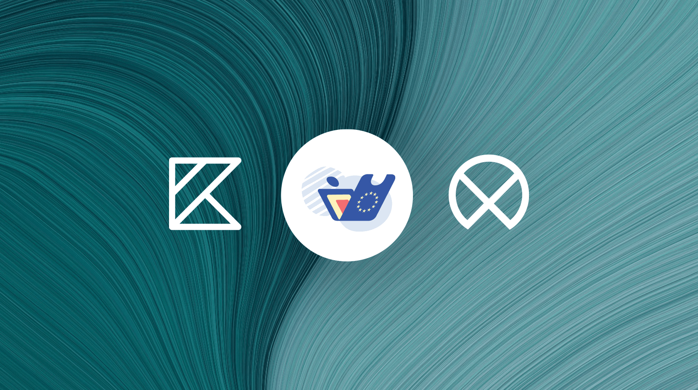

# EUDIW 🇪🇺🇱🇻: Android App

This project is the **NOBID [EUDIW](https://ec.europa.eu/digital-building-blocks/sites/display/EUDIGITALIDENTITYWALLET/EU+Digital+Identity+Wallet+Home) Latvia** App for Android.

It bundles and uses **EUDIW Latvia WebApp** (built on [LX/UI platform](https://github.com/wntrtech/lx-ui)) for consistent UI and should offer feature parity with **EUDIW iOS App**.

---

## Contents

* [1. Prerequisites](#1-prerequisites)
* [2. Cloning the Project](#2-cloning-the-project)
* [3. Initializing the WebView (Vue) Application](#3-initializing-the-webview-vue-application)
* [4. Opening and Building the Project in Android Studio](#4-opening-and-building-the-project-in-android-studio)
* [5. Building Release Version](#5-building-release-version)
* [6. Module Structure](#6-module-structure)
* [7. Product Flavors](#7-product-flavors)
* [8. Deeplink Schemes](#8-deeplink-schemes)
* [9. Additional Information](#9-additional-information)

  * [9.1. Library Version Management (`libs.versions.toml`)](#91-library-version-management-libsversionstoml)
  * [9.2. Building Android Releases (Official Documentation)](#92-building-android-releases-official-documentation)
  * [9.3. Endpoint Configuration per Build Variant](#93-endpoint-configuration-per-build-variant)
  * [9.4. Code Signing (Release build)](#94-code-signing-release-build)
* [References](#references)

---

## 1. Prerequisites

To successfully compile and run the project, the following tools are required:

* **Android Studio** (latest stable version recommended)
* **Java Development Kit (JDK)** – version 17
* **Android SDK** with proper API levels
* **Gradle** (bundled with Android Studio) – version 8.10.2
* **Android Gradle Plugin (AGP)** – version 8.8.0
* **Git** for version control
* **Node.js** + **pnpm** (JavaScript package manager) for WebView app build
* Install `pnpm` globally:

  ```bash
  npm install -g pnpm
  ```

---

## 2. Cloning the Project

```bash
git clone https://example.com/mobile-android.git
cd mobile-android
```

---

## 3. Initializing the WebView (Vue) Application

The app includes an embedded Vue.js application used in WebView, located at:
`resources-logic/src/main/assets/vue-app/`

To initialize and build it:

```bash
cd resources-logic/src/main/assets/vue-app
pnpm install
pnpm run build
```

---

## 4. Opening and Building the Project in Android Studio

1. Launch Android Studio.
2. Open the root directory of the project.
3. Sync Gradle (if it doesn’t happen automatically: **File > Sync Project with Gradle Files**).
4. Select the appropriate **product flavor** (`demo`, `prod`, etc.).
5. Choose the target emulator/device and run the app via **Run** or `Shift+F10`.
6. The main `AndroidManifest.xml` file is located in the `assembly-logic` module:

```
assembly-logic/src/main/AndroidManifest.xml
```

This manifest is considered the **main one** and contains:

* the main `application` tag,
* `activity` definitions,
* deeplink configuration (generated during build).

Other modules (`feature`, `core`, etc.) include only additional parts (`manifestPlaceholders` or `library manifests`), which are merged at build time.

---

## 5. Building Release Version

Release builds are generated automatically via CI/CD using the `release.yml` GitHub Actions pipeline. To trigger it:

1. Create a Git tag in the following format:

   ```bash
   git tag v1.2.3
   git push origin v1.2.3
   ```

2. The CI system will automatically start the release build and generate APK/AAB artifacts.

---

## 6. Module Structure

The project is structured according to **Clean Architecture** principles, with a clear separation between logic, network, UI, and functional components.

| Module                    | Description                                           |
| ------------------------- | ----------------------------------------------------- |
| `app`                     | Main Android app entry (`Application`, `Activity`)    |
| `build-logic`             | Gradle configuration and custom plugins               |
| `analytics-logic`         | Analytics for usage and events                        |
| `assembly-logic`          | Dependency injection and module composition logic     |
| `auth-logic`              | PIN and biometric authentication                      |
| `business-logic`          | Business rules and domain logic                       |
| `common-feature`          | Shared UI and functionality components                |
| `core-logic`              | Core configuration and shared utilities               |
| `features/`               | Main functional submodules                            |
| └─ `dashboard-feature`    | User dashboard screen                                 |
| └─ `issuance-feature`     | Document issuance function                            |
| └─ `presentation-feature` | Document presentation module                          |
| └─ `transactions-feature` | Transaction management                                |
| `network-logic`           | API clients, endpoints, and network configuration     |
| `resources-logic`         | App resources (including Vue WebView)                 |
| `startup-feature`         | Splash screen and app initialization                  |
| `storage-logic`           | Local storage, cache, preferences                     |
| `ui-logic`                | Shared UI components, themes, styles                  |
| `web-bridge`              | Communication bridge between WebView and native logic |
| `web-feature`             | WebView-based part of the app (Vue, HTML, JS)         |

---

## 7. Product Flavors

Available build flavors, configured in `ConfigLogicImpl.kt`:

* `zzdev` – ZZ Development mode
* `zzweb` – ZZ Web mode
* `zzdemo` – ZZ Demo version
* `demo` – Client demo version
* `prod` – Production version

---

## 8. Deeplink Schemes

The table below lists all supported deeplink formats. Each deeplink has a `scheme://host` part and is used to trigger specific actions in the app. Configuration is defined in `AndroidLibraryConventionPlugin.kt`.

| Deeplink URI                         | Function           | Description                                                |
| ------------------------------------ | ------------------ | ---------------------------------------------------------- |
| `nobid.lv://`                        | Wallet Deeplink    | Opens the app in the main view.                            |
| `nobid.lv://auth-done`               | eParaksts Redirect | Completes eParaksts authentication and returns to the app. |
| `openid4vp://`                       | OPENID4VP          | Starts document presentation.                              |
| `eudi-openid4vp://`                  | OPENID4VP          | Starts document presentation.                              |
| `mdoc-openid4vp://`                  | OPENID4VP          | Starts document presentation.                              |
| `openid-credential-offer://`         | CREDENTIAL_OFFER   | Adds a new document.                                       |
| `eu.europa.ec.euidi://authorization` | ISSUANCE           | Handles document issuance after authorization.             |
| `fileshare://`                       | SIGN_DOCUMENT      | Opens the document signing screen or WebView.              |

---

## 9. Additional Information

### 9.1. Library Version Management (`libs.versions.toml`)

All external library versions are centrally managed in the following file:

```
gradle/libs.versions.toml
```

This ensures version consistency across all modules. Example:

```toml
[libraries]
kotlin-coroutines = "org.jetbrains.kotlinx:kotlinx-coroutines-core:1.7.3"
retrofit = "com.squareup.retrofit2:retrofit:2.9.0"
```

---

### 9.2. Building Android Releases (Official Documentation)

Full guide for building and publishing Android releases is available in the official documentation:
📌 [https://developer.android.com/studio/publish](https://developer.android.com/studio/publish)

It includes:

* Building APK/AAB
* Signing configuration (`keystore`, `keyAlias`, etc.)
* Publishing to Google Play Store

---

### 9.3. Endpoint Configuration per Build Variant

Depending on the build flavor, the app uses different server endpoints. They are defined in:

```
core-logic/src/main/kotlin/com/edim/config/ConfigLogicImpl.kt
```

This approach provides flexibility for testing, demo, and production environments.

---

### 9.4. Code Signing (Release build)

Signing configuration is done via `keystore.properties`, which is **not version-controlled** and stored locally or in CI.

Example file:

```
storeFile=keystore.jks
storePassword=********
keyAlias=releaseKey
keyPassword=********
```

In CI/CD, `secrets` are used to sign without exposing sensitive info.

---

## References

* [Wallet Core SDK](https://github.com/eu-digital-identity-wallet/eudi-lib-android-wallet-core)
* [OWASP MASVS](https://mas.owasp.org/MASVS/)
* [Play Integrity API](https://developer.android.com/google/play/integrity)
